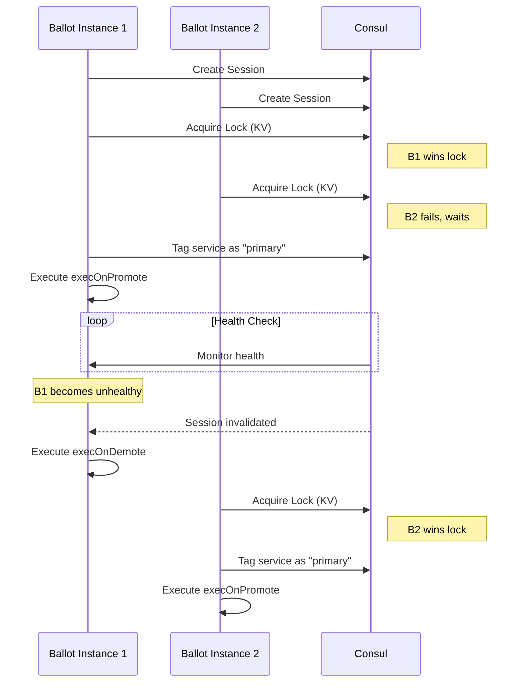

# Ballot

[](https://github.com/ncode/ballot/actions/workflows/go.yml)
[](https://goreportcard.com/report/github.com/ncode/ballot)
[](https://opensource.org/licenses/Apache-2.0)
[](https://codecov.io/gh/ncode/ballot)

Consul-based leader election tool with tagging support and hooks for automated tasks on leadership changes.

### What is it?

Ballot fills a gap in Consul's functionality by providing a built-in feature for leader election among registered services. It designates a leader among multiple services, marks the chosen leader with a specified tag, and allows for the execution of a script whenever a leader election occurs.

### How does it work?

Ballot leverages Consul's session and key-value (KV) store APIs to perform leader election:

1. Session Creation: Each service instance creates a Consul session.
2. Lock Acquisition: Instances attempt to acquire a lock on a predefined Consul KV key using their session.
3. Leader Election: The instance that successfully acquires the lock is elected as the leader.
4. Tagging the Leader: The leader is tagged with a specified tag (e.g., primary) in the Consul catalog.
5. Health Checks: The leader's health is continuously monitored. If the leader becomes unhealthy, the lock is released, and a new election occurs.
6. Hooks Execution: Custom scripts or commands can be executed when a service is promoted to leader or demoted.



More information about Consul sessions and leader elections can be found in [https://developer.hashicorp.com/consul/tutorials/developer-configuration/application-leader-elections](https://developer.hashicorp.com/consul/tutorials/developer-configuration/application-leader-elections).

### Requirements

- Go 1.21 or higher
- Consul 1.10 or higher

### Installation

**Using Go:**
```bash
go install github.com/ncode/ballot@latest
```

**From source:**
```bash
git clone https://github.com/ncode/ballot
cd ballot
go build -o ballot .
```

### Usage

```bash
# Run with a config file
ballot run --config /path/to/config.yaml

# Default config location: $HOME/.ballot.yaml
ballot run
```

Ballot also supports environment variables via Viper. Any config option can be set using the `BALLOT_` prefix (e.g., `BALLOT_CONSUL_TOKEN`).

### How to try it?

1. Install Ballot
```bash
$ git clone https://github.com/ncode/ballot
$ cd configs/development
```
2. Run the development setup
```bash
$ make &
```
3. Open consul ui http://127.0.0.1:8500/ui/dc1/services/my-service/instances
4. Play with the health checks and see the election happening and moving
```bash
$ find consul/state
consul/state
consul/state/ready1
consul/state/ready3
consul/state/ready2
$ rm consul/state/ready1
$ sleep 10
$ touch consul/state/ready1
$ rm consul/state/ready2
$ sleep 10
$ touch consul/state/ready2
$ rm consul/state/ready3
$ sleep 10
$ touch consul/state/ready3
```

### Environment variables

During the call of execOnPromote and execOnDemote a few environment variables are injected in case you need to use the address and port of the service for automation.

```bash
$ADDRESS   # IP Address of the current service elected
$PORT      # Port of the service
$SESSIONID # Current SessionID of the elected master
```

### Configuration

The configuration file is a yaml file with the following structure:

```yaml
consul:
  token:                                    # Consul token
election:
  enabled:
    - my-service-name                       # Name of the service enabled for election
  services:
    my-service-name:                        # Name of the service
      id: my-service-name                   # ID of the service
      key: my-service-name                  # Key to be used for the lock in Consul, this should be the same across all nodes
      token:                                # Token to be used for the session in Consul
      serviceChecks:                        # List of checks to be used to determine the health of the service
        - ping                              # Name of the check
      primaryTag: primary                   # Tag to be used to mark the leader
      execOnPromote: '/bin/echo primary'    # Command to be executed when the service is elected as leader
      execOnDemote: '/bin/echo secondary'   # Command to be executed when the service is demoted as leader
      ttl: 10s                              # TTL for the session
      lockDelay: 5s                         # Lock delay for the session
```

### Development and examples

Examples of configuration files and service definitions can be found inside `configs/development`.

### Production deployment

Ballot handles SIGINT and SIGTERM for graceful shutdown. Logs are output in JSON format to stdout.

**Systemd example:**
```ini
[Unit]
Description=Ballot Leader Election
After=network.target consul.service
Wants=consul.service

[Service]
Type=simple
ExecStart=/usr/local/bin/ballot run --config /etc/ballot/config.yaml
Restart=on-failure
RestartSec=5

[Install]
WantedBy=multi-user.target
```

**Multiple elections:** Ballot can manage elections for multiple services simultaneously. Add multiple entries to `election.enabled` and configure each under `election.services`.

### Contributing

Contributions are welcome! Please:
- Open an issue to discuss significant changes before submitting a PR
- Include tests for bug fixes and new features
- Run `go test ./...` and `go vet ./...` before submitting

### TODO

- Allow to pre-define the preferred leader

### License

This project is licensed under the Apache License 2.0. See the LICENSE file for details.
